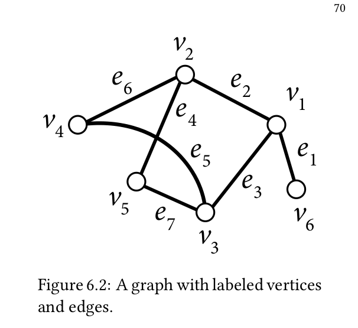
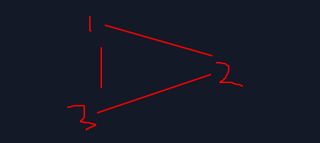
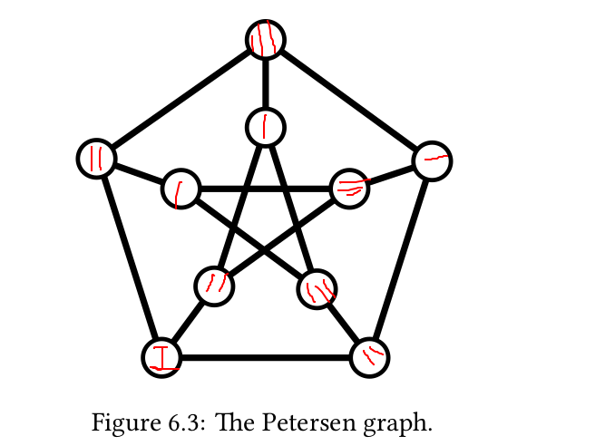
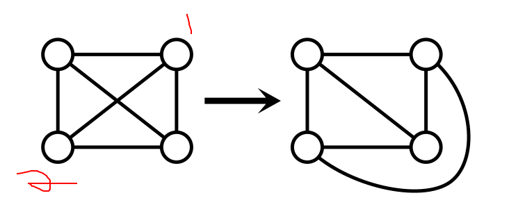
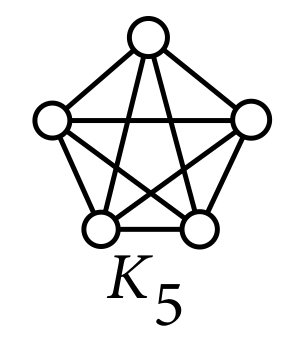

# Graphs!

There are some basic definitions and some more complex definitions.

## Basic Definitions:

A graph G(V,E) is all the points called vertices interconnected in any matter through edges. An edge e that is an element of E
is given by the tuple (v,u), where v and u are vertices, and v and u being connected give them the name of adjacents. A important 
thing to notice is that the vertices of a graph do not need to all be connected to each other, so that is why E is in (E 2), but
not necessarily E = (E 2). (E 2) in here means all the combinations of 2 elements of E without position influence.  The edge e then
is the incident of both v and u. v and u are also neighboors and the quantity of neighbors that the vertice v has is called the degree
of the vertice v. Path is the the sequence v1,e1,v2,e2,... that walks from a vertice to another one WITHOUT getting back repeating any
vertice. A subgraph of G is a graph H where all the vertices of H are in G and all the edges of H are in E. A cool thing to notice is that 
we cannot have a vertice in H connected to a verse in G-H, because it would get out of the subgraph.
Down below is a picture that can be used as a way to see all the definitions above in practice.
 

## Definition:
A k-colouring of a graph G(V,E) is a function phi: V->{1,...,k}, that is it connects all the vertices to a natural number till k, inclusive.
We call the edge (v,u) properly coloured if phi(v) != phi(u). What that means is if I get a graph of 10 vertices for example, and k is equal
to 3, and each k represents a color, a properly coloured vertice will not have its adjacent of the same color - tagged with the same natural
number. Otherwise, we call the edge e impropely coloured. There will be many ways the function phi can be defined, and it is defined so that all the edged are properly, then phi is called proper. If a G graph has a proper k-colouring, we call it k-colouring.

The example above is a simple example, but it shows how a triangle is a graph 3-colouring, because there is a function phi so that each vertice
has a different color when compared to its adjacent.

Down below is the Peterson Graph. Notice that it is k-coloured, and that does not mean that a vertice v can have two equally coloured vertices
connected to it. It means that it cannot connect a vertice to another of the same color only

## Definition:
The chromatic number of a graph is the minimum number k which G is k-coloured. 

Example: for the perterson graph, the chromatic number is 3. There is no way to label all the vertices only with 1 or 2 numbers without
repeating them in adjacent vertices.

## Definition:
For a graph G, if we get the vertice v of degree d of G, then the chromatic number of G is <= d + 1.

Proof: the proof is actually simple, and I'm gonna use the start graph above. We use an easy algorithm for painting the graph so that it can
be k-coloured. We get a vertice and then label this vertice with a color that is different from all its neighbors. In the vertice v, the center
of the start graph, we will have then d + 1 colours in the case all the other vertices connected to v are all of d different colours. A better
scenario is when two of there vertices connected to the vertice v do have the same colour - for that they can't be connected. But let's do it
for the worst scenario. In the worst scenario then, the vertice v of largest degree - this is important - will have maximum d + 1 different coloured neighbors. Then the chromatic number is d + 1 - or less, for a better scenario.

## Definition:
A planar graph is a graph that be drawn on a plane without its edgdes crossing.

The graph above is planar because we can take the vertices edge incident to vertices 1 and 2 and move it outside so that it maintains the 
connectivity but it avoids crossing other edges.

The graph below is not planar.

