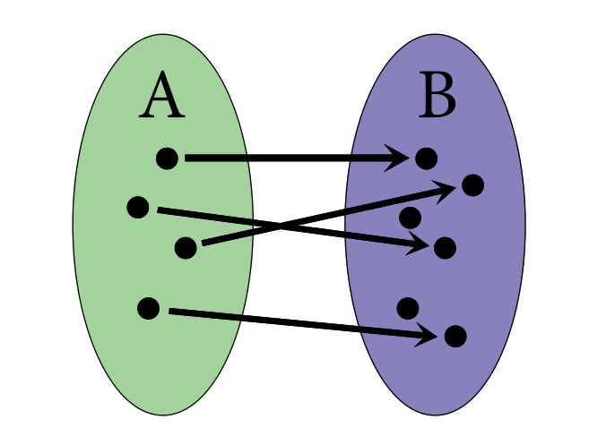
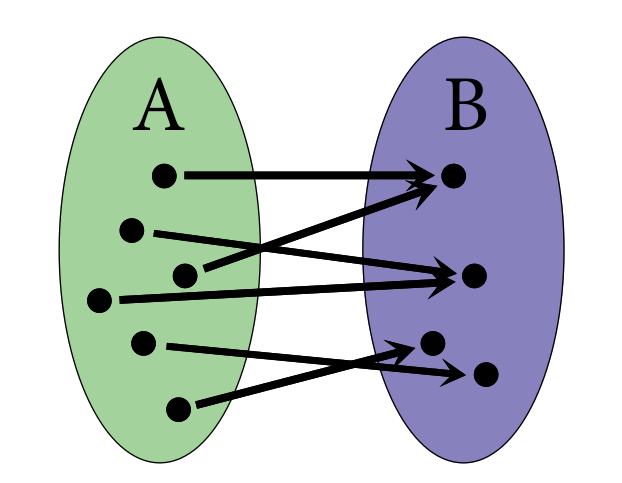
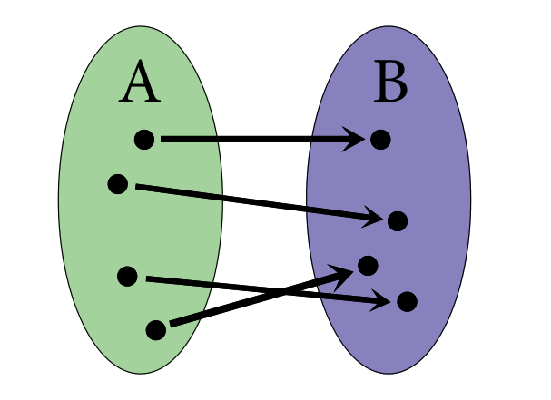

# Sets

## Definitions:

1. The cardinality of a set is the number of elements in a set.
2. A set B is subset of A if all elements of B are in A. 
Example: The set of all numbers divisible by 77 is a subset of all the numbers divisible by 7.
3. The complement of a set B in a set A are all elements in A that are not in B. 
Example: The complement of N in Z are all negative integers (Z - N). If B has no element in A, then A - B = A.
4. The union of two sets is such that an element either is of A or is of B.
Example: {1,2,3,4} united with {2,3,5,6} is {1,2,3,4,5,6}. For which member of this united set, we can label it with a tag showing
it is of A or B.
5. The intersection of two sets are the elements that are of both sets simulteneously.
Example: All the body parts shared by a girl and a boy are the intersection of them. All the parts of a boy not in a girl are the complement of the girl's set, and virse-versa.
6. The product of two sets is A X B so that we have a pair (a,b) such that a is in A and b is in B. The cardinality of A X B follows to be |A|x|B|
Example: {1,2,3} x {1,3,5} = (1,1),(1,3),(1,5),(2,1),(2,3),(2,5),(3,1),(3,3),(3,5) = 9 = 3 x 3 elements. To do it in programming, just do a for loop on the set A and an inside for loop on the set B. The product A x B can be seen on a matrix (my guess).
7. Function is a subset of A x B such that for each a in A there is a pair (a,b) that there is in F. (I know, defining a function in set theory is kind crazy). A is the domain of F and B is the codomain of B. Remembering that the codomain are the possible values of F(a), not necessarily all values of F(a).
Example: Be f(x) = x^2 so that F: R -> R. We wont be able to get all the codomain R with only that function. Think of x^2 = -1 for example.
8. The image of the function of are all possible values for which f(a) gives a value in the codomain. 
Example: f(x) = 1 + 1/x, f: R -> R. The image of f includes all values, but not 0, for example, because there will be no valid output out of f(0).
9. The preimage of the function f. I just got this through examples. Basically is the set of the inverse of the function.
Example: for the f = x^2, f^-1(9) = {3,-3} , because these two values give f(3 or -3) = 9.
10. Injection: For a single output, there is only one single input. For a single input, there is only a single output is the definition of a function HAHA! The image below shows how injection is. 
Example: Injective function f(x) = x, f: R -> R. Non-injective f(x) = x^2, f: Z -> Z, because 4,-4 point to the same output. Another way to define it is that the preimage of f has only 1 or zero elements (If I get a point on the codomain, I can only map it to a point or no point in the domain.)

11. Surjection: when all the elements of the codomain of a function are hit through an element of the domain. So, the image of the function is equal to the codomain. 
Example: f = x^2,f: R+ -> R+ is surjective, because all the positive reals of the codomain will have their square root in the domain. This function is also injective, because there will be no output produced by two different inputs. Every input produces a different output. Therefore, the function is bijective - injective and surjective!
Another way to see it is that the inverse of f for an element b is non-empty. There is always a a such that f(a) = b.

12. Bijective: just to make sure: All inputs on f will produce a different output and all possible outputs will have a unique input related to it.

13. Inverse function: For bijective functions it is important to define the inverse function. All bijective functions will have inverse. Finding their inverse though cannot be an easy task - as experienced in linear algebra and functions like sha256. Inverse function: The domain of the function f is the codomain of its inverse and the domain of its inverse is the codomain of f. So, g being the inverse, g(f(a)=b) = a and f(g(b)) = b.
14. Fact: inverses are unique. The proof is done by showing that the if there were two inverse functions, they'd produce the same output for the same input all the time. So, they must be the same.

Notes from the chapter:

Three strategies for proofs:

Clever Bijections:
It is used usually when trying to count something. But sometimes counting is hard, so we find another set that much easier to count that will reveal the information about the set we are trying to count. It is basically, count on something similar, but easier. The bijection term comes in this similar approach - both sets being biject to each other will have the same count, so we'll actually have found the count for the first one too!
Example:
Count how many games are played when there is single-elimination in a tournament of n participants.

Well, if n = 4, then 4/2 + 4/4 = 3 games played. If n = 5, then 4/2 + 4/4 + 1 = 4 games. We could prove this by induction having the hapythosis that for a tournament of n, there will be n-1 games.

But, let's use the clever bijection. Just notice that the each game has a loser.
At the end of the tournament there will be n - 1 losers. So, n-1 games need to be played! Clever bijection!

Ok, so, where is the bijection in here? Formally stated, it is instead of associating a function f from the set P of participants to the set of G games, we associate the set of L losers to the set of G games. The thing is that L is subset of P (it has all participants in it minus the winner). And L -> G is surjective. 
There will always be a loser for a game. But P -> G is non-surjective. Anyways, we changed the reference of the set we're trying to count

Induction:
Prove that f(n) is true for a small n. Assumes that f(n) is true for a random n.
Prove f(n+1) is true having the hypotesis that f(n) is true. So, if small n = 3,
then assume for any n, and prove for n + 1. After proved, then it is true for n = 3, n = 4 (hypostesis), and  n = 5 (proved). The same for 6,7,8,9,... all n's.

Contraditory:
Assumes it is a contradition, find and object and go foward with that object till comes to somethinhg non-sense.
Example: there always will be two people in a congragation that will have the same amount of FRIENDS (person knows friend and friend knows person). Assume there will be not, so there will be n people at the party, each knowing an amount of people that is in the range 0, n-1 inclusive. There are then n possibilities for the amount of people a person is friend to. There is also n people in the congregation. So, there will be one person who knows n-1 people and another who knows 0 people. But the person who is friend of n - 1 is friend of everyone. The person with 0 is friend of nobody. Contradition!

